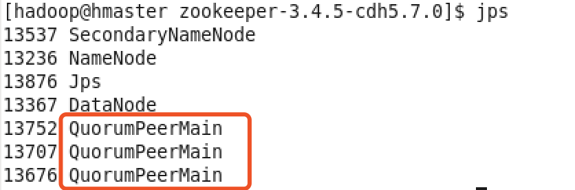
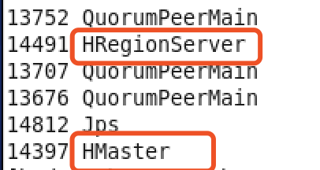

# # 大数据服务器需要做的一系列操作
## 启动
### 命令行操作
1. 启动hdfs：start-dfs.sh
1.2 打开浏览器：hamster:50070验证
2. 启动zookeeper实例
```
./bin/zkServer.sh start conf/zoo1.cfg
./bin/zkServer.sh start conf/zoo2.cfg
./bin/zkServer.sh start conf/zoo3.cfg
```
验证启动是否成功
Jps会出现三个QuorumPeerMain


./bin/zkServer.sh status conf/zoo3.cfg
3. 启动HBase
./bin/start-hbase.sh
多了HRegionServer，HMaster


验证Hbase是否启动：在浏览器中输入hmaster:60010
操作HBase：./bin/hbase shell
4. 启动kafka
```
kafka-server-start.sh -daemon /home/hadoop/app/kafka_2.11-0.9.0.0/config/server.properties（加入-daemon的作用是不在控制台显示，默认后台启动）
```
4.1 查看topic：./kafka-topics.sh --zookeeper 127.0.0.1:2181 --list
hello_topic
4.2 创建一个topic
kafka-topics.sh —create —zookeeper hmaster:2181 —replication-factor 1 —partitions 1 —topic hello_topic
4.3 生产者发送消息
```
kafka-console-producer.sh --broker-list hmaster:9092 --topic hello_topic
```
4.4 消费者接受消息
```
kafka-console-consumer.sh -zookeeper hmaster:2181 --topic hello_topic --from-beginning
```
**如何查看目前的消费者是否已经读到最新的数据：**
kafka-run-class.sh kafka.tools.ConsumerOffsetChecker
5. 启动flume
再启动两个flume的配置文件：
第一个配置文件启动：avro-memory-kafka.conf 
```
flume-ng agent --name a1 --conf /home/hadoop/app/apache-flume-1.6.0-cdh5.7.0-bin/conf --conf-file /home/hadoop/app/apache-flume-1.6.0-cdh5.7.0-bin/conf/avro-memory-kafka.conf -Dflume.root.logger=INFO,console
```
第二个配置文件启动：exec-memory-avro.conf
```
flume-ng agent --name a2 --conf /home/hadoop/app/apache-flume-1.6.0-cdh5.7.0-bin/conf --conf-file /home/hadoop/app/apache-flume-1.6.0-cdh5.7.0-bin/conf/exec-memory-avro.conf -Dflume.root.logger=INFO,console
```


至此后台服务器已经全部启动，剩下的交给前台。
6. crontab的使用
为了测试数据的连通性，使用crontab来不断生成数据，第一次去学这个的语法。crontab -e是打开配置文件，添加这些配置，/etc/init.d/crond stop可以停止服务
```
* * * * * /bin/date >> /home/hadoop/data/data.log
* * * * * sleep 10; /bin/date >> /home/hadoop/data/data.log
* * * * * sleep 20; /bin/date >> /home/hadoop/data/data.log
* * * * * sleep 30; /bin/date >> /home/hadoop/data/data.log
* * * * * sleep 40; /bin/date >> /home/hadoop/data/data.log
* * * * * sleep 50; /bin/date >> /home/hadoop/data/data.log
```

## 关闭
```
 stop-dfs.sh
./bin/zkServer.sh stop conf/zoo1.cfg
./bin/stop-hbase.sh
bin/kafka-server-stop.sh
```


