# 大数据生态环境安装
基础环境：
1. centos


## 安装过程
### 1. JDK安装
1.1 查看已经上传的jdk文件，并安装
安装命令： yum localinstall -y jdk-8u171-linux-x64.rpm
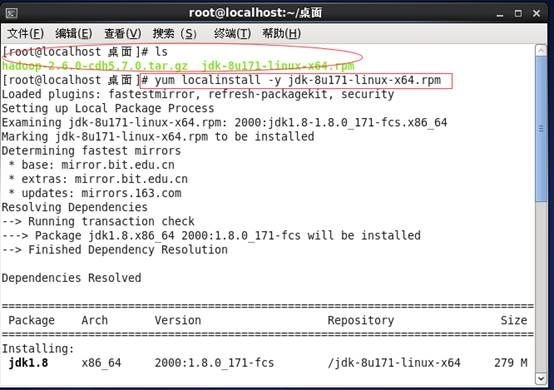
1.2 添加到系统环境变量： ~/.bash_profile
       
```  
export JAVA_HOME=/usr/java/jdk1.8.0_171-amd64
export PATH=$JAVA_HOME/bin:$PATH:$HOME/bin
```
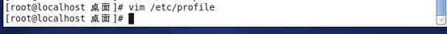


### 2. 安装Hadoop

2.1. 下载并解压Hadoop，
已经下载并放到桌面上，直接解压，安装
解压：tar -zxvf Hadoop-2.6.0-cdh5.7.0.tar.gz
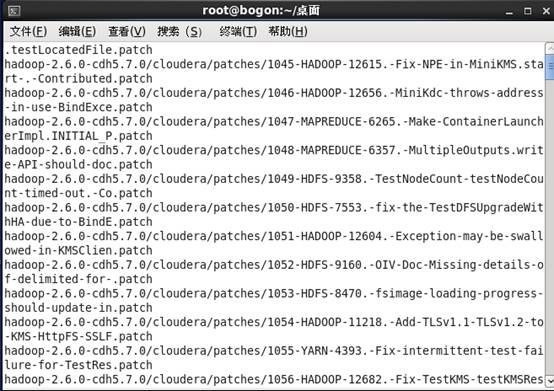
查看目录，并进入/etc/Hadoop/
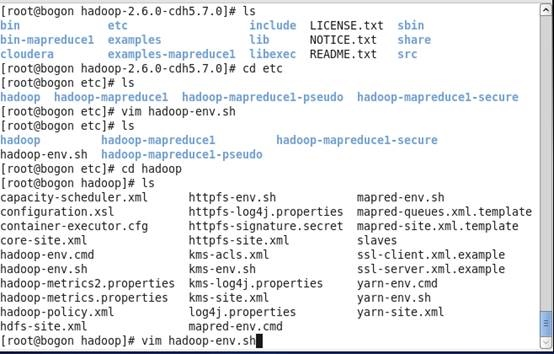

2.2.   修改配置文件

hadoop配置文件的修改($HADDOP_HOME/etc/hadoop)
hadoop-env.sh

         export JAVA_HOME=/usr/java/jdk1.8.0_171-amd64
         
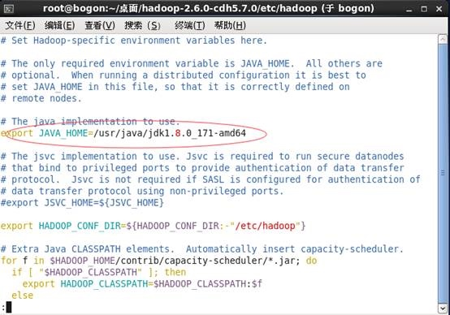
         

```
 core-site.xml

         <property>

             <name>fs.defaultFS</name>

             <value>hdfs://localhost:9000</value>

         </property>

 

         由于hadoop伪分布式存储默认使用宿主系统的临时文件夹，会导致每次宿主系统重启后丢失，需要手动制定一个目录

         <property>

              <name>hadoop.tmp.dir</name>

              <value>/home/hadoop/app/tmp</value>

         </property>

 

     hdfs-site.xml

         <property>

            <name>dfs.replication</name>

             <value>1</value>

        </property>
```    
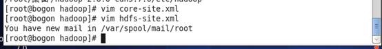
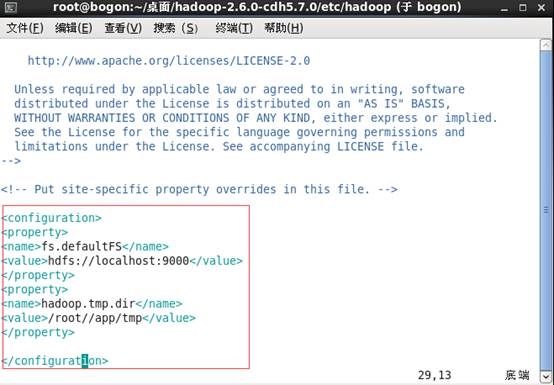
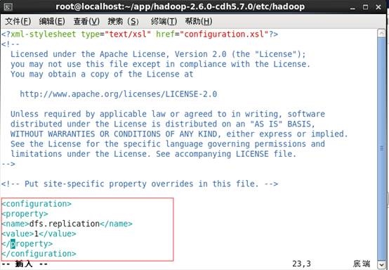
2.3 给Hadoop配置环境变量

添加环境变量：

```
export HADOOP_HOME=/home/hadoop/app/hadoop-2.6.0-cdh5.7.0

export PATH=$HADOOP_HOME/bin:$HADOOP_HOME/sbin:$PATH
```
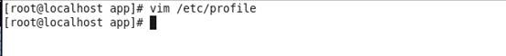
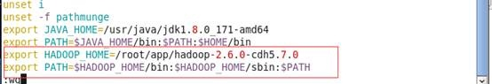
2.4 使环境变量生效 source /etc/profile

查看Hadoop
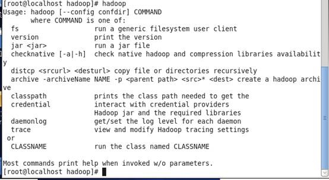
2.5 启动hdfs

2.6 格式化分布式文件系统（仅第一次执行即可，不可重复执行）：

     hdfs namenode -format
     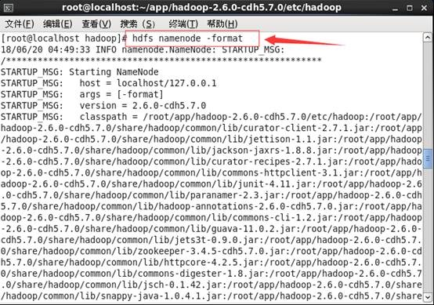
启动: start-dfs.sh
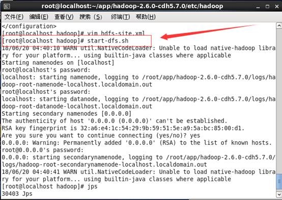
2.7 验证是否启动成功：

         jps

              NameNode

              SecondaryNameNode

              DataNode
            
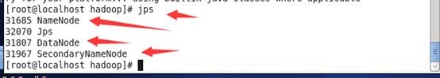
2.8 浏览器访问方式：http://localhost:50070
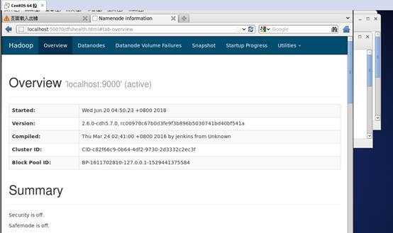
2.9 关闭hdfs

     stop-dfs.sh
     
### 3.安装Zookeeper

将zookeeper解压到app目录中，

因为需要配置一个伪分布式环境，需要模拟3个节点，所以要配置3个配置文件：zoo1.cfg, zoo2.cfg, zoo3.cfg
复制3个内容一样的配置文件:

```
         mv zoo_sample.cfg zoo1.cfg

         cp zoo1.cfg zoo2.cfg

         cp zoo1.cfg zoo3.cfg
```
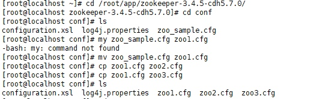
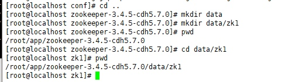
/root/app/zookeeper-3.4.5-cdh5.7.0/data/zk1

在zoo1.cfg中修改


```2. 分别配置 zoo1.cfg, zoo2.cfg, zoo3.cfg

         a) conf/zoo1.cfg

              修改: dataDir=/home/hadoop/app/zookeeper-3.4.5-cdh5.7.0/data/zk1

                     clientPort=2181

              新增:

                   server.1=127.0.0.1:2888:3888

                   server.2=127.0.0.1:2889:3889

                   server.3=127.0.0.1:2890:3890

                  

         b) conf/zoo2.cfg

              修改：dataDir=/home/hadoop/app/zookeeper-3.4.5-cdh5.7.0/data/zk2

                     clientPort=2182

              新增:

                   server.1=127.0.0.1:2888:3888

                   server.2=127.0.0.1:2889:3889

                   server.3=127.0.0.1:2890:3890

                  

         c) conf/zoo3.cfg

              修改：dataDir=/home/hadoop/app/zookeeper-3.4.5-cdh5.7.0/data/zk3

                     clientPort=2183

              新增:

                   server.1=127.0.0.1:2888:3888

                   server.2=127.0.0.1:2889:3889

                   server.3=127.0.0.1:2890:3890
```

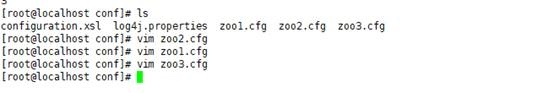

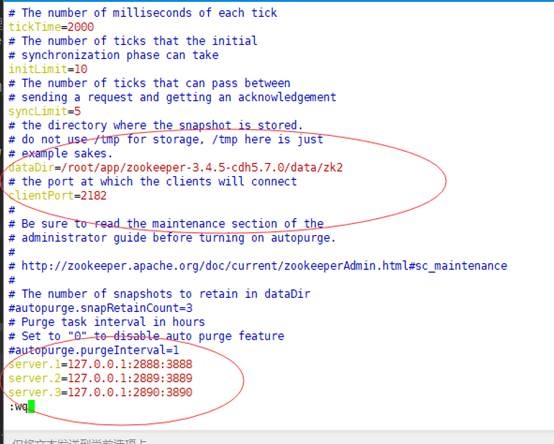
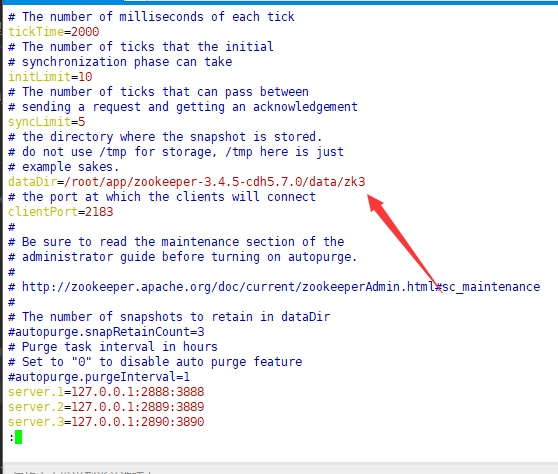
创建zookeeper的文件存储目录
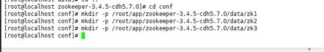
创建节点标志

启动zookeeper实例

./bin/zkServer.sh start conf/zoo3.cfg
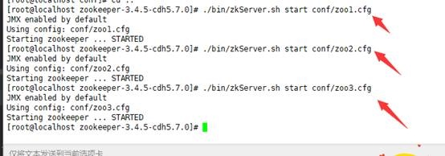
验证zookeeper是否启动成功

 ./bin/zkServer.sh status conf/zoo3.cfg
 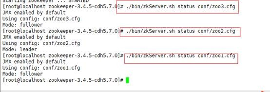
多了三个QuorumPeerMain
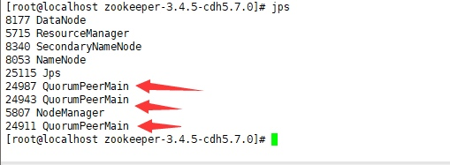
### 4. Hbase的安装与启动

2. 配置 $HBASE_HOME/conf/hbase-site.xml

```
             <!--配置hbase的根目录，一般配置成hdfs-->

              <property>

                   <name>hbase.rootdir</name>

                   <value>hdfs://115.26.129.107:9000/hbase</value>

              </property>

             

              <!--配置hbase的节点信息的存储目录，需要配置成zookeeper的节点信息存储目录-->

              <property>

                   <name>hbase.zookeeper.property.dataDir</name>

                   <value>/home/hadoop/app/zookeeper-3.4.5-cdh5.7.0/data/zk1</value>

              </property>

             

              <!--开启hbase的分布式模式开关-->

              <property>

                   <name>hbase.cluster.distributed</name>

                   <value>true</value>

              </property>

             

              <!--和zookeeper通信端口-->

              <property>

                   <name>hbase.zookeeper.property.clientPort</name>

                   <value>2181</value>

              </property>

             

              <!--告知hbase所有的zookeeper实例-->

              <property>

                   <name>hbase.zookeeper.quorum</name>

                   <value>127.0.0.1:2181,127.0.0.1:2182,127.0.0.1:2183</value>

              </property>


```
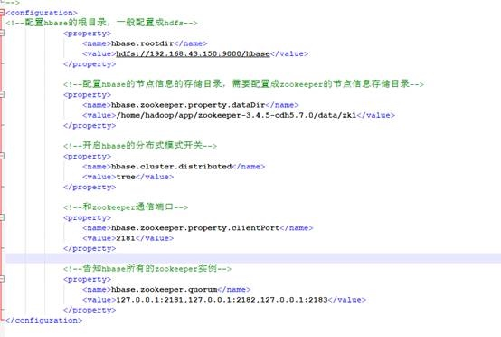
配置 $HBASE_HOME/conf/hbase-env.sh

              修改: JAVA_HOME=/usr/java/jdk1.8.0_171-amd64

                     HBASE_MANAGES_ZK=false
                     
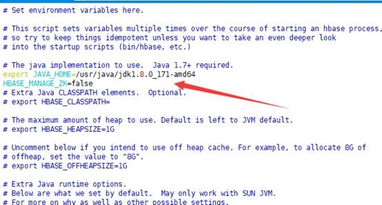
启动. /bin/start-hbase.sh

多了HRegionServer，HMaster

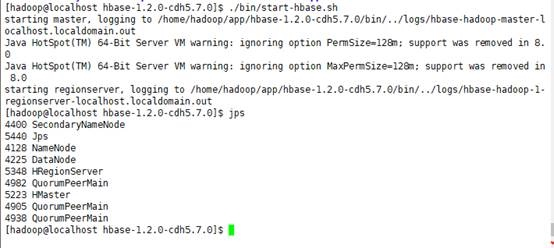
验证Hbase是否启动

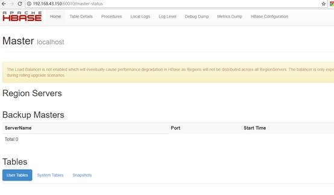
                    