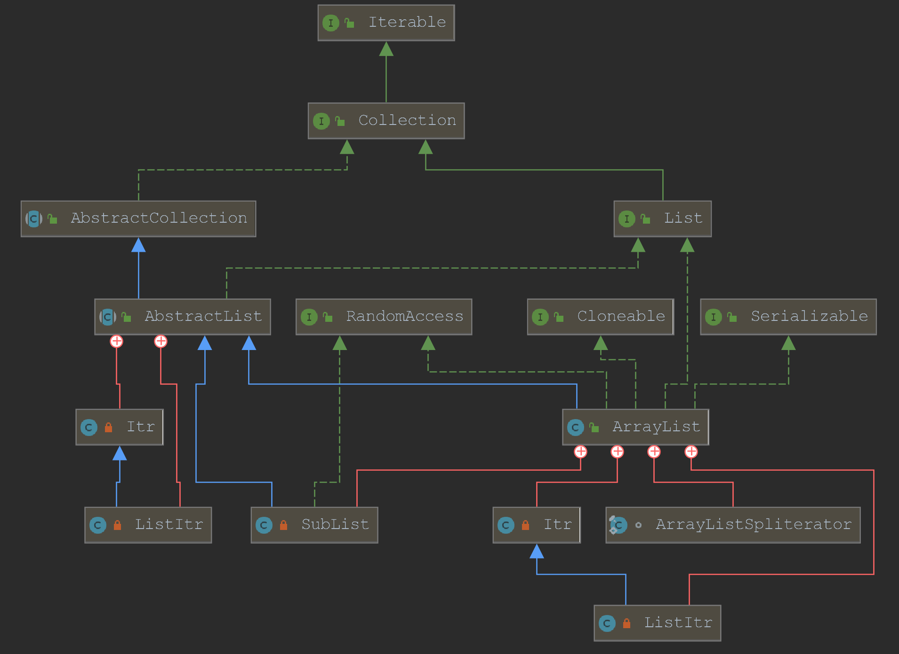
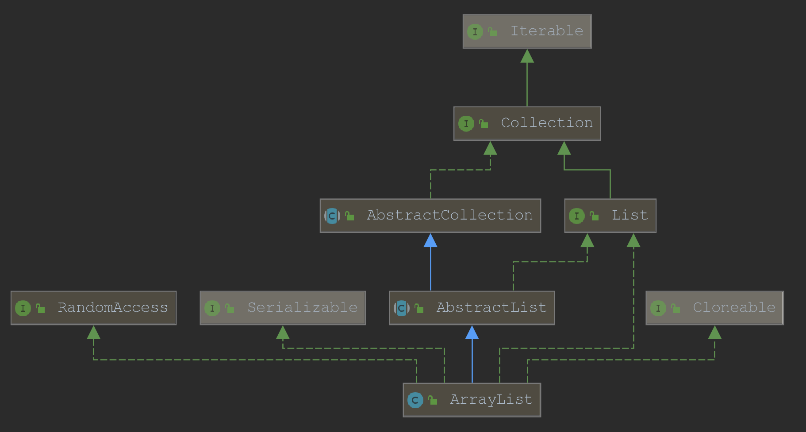
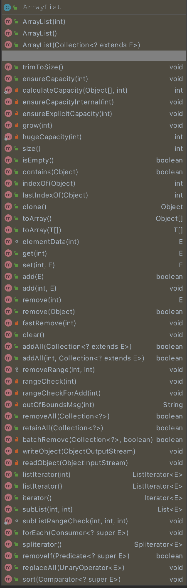
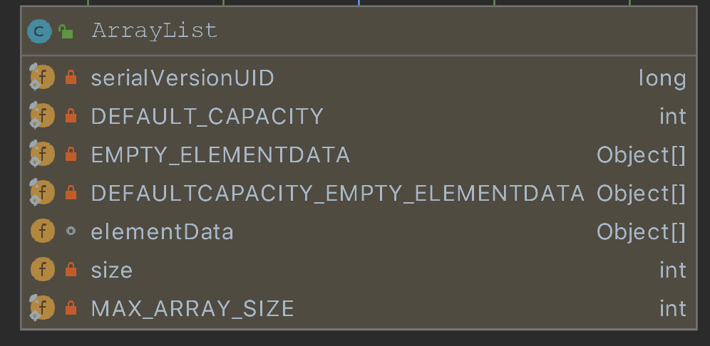

# Java集合(三)之ArrayList源码分析

在平时开发中，List是经常用来存放数据的一个集合了，根据前文说过的，List下有LinkedList，ArrayList，Vector，其中又以ArrayList使用频率最高，以至于我都忘记最开始是怎么知道它的，好像看别人代码里是这么写的，这么多年我也一直这样干。慢慢的也产生了疑问，为什么这么用，它的方法是怎么实现的，底层的数据结构是什么，等等问题。

但在每次使用时我还是会想一下，为什么要这样引用。`List<Object> list = new ArrayList<>();`，为什么前面是List，而不是ArrayList，或者是顶级接口Collection，这几种写法都是对的，借用其他文章里的一段话，我觉得能很好的解释这个问题。

> 向上转型：子类对象会遗失和父类不同的方法。丢失的子类特有方法
>
> 向下转型：可以调用子类那些特有的方法，重新获得丢失的子类特有方法<泛型是常用>
>
> 第一种形式用当前类作为引用类型，那么可以访问到ArrayList这个类中的所有公用方法。
>
> 第二种形式，用ArrayList实现的接口List作为引用类型，那么通过list引用可以访问到接口中定义的方法。也就是说ArrayList这个类实现了List接口，除了要必须实现接口List中声明的方法外，还可以实现额外的一些方法。但是，第二种形式就无法调用的List接口以外的方法。
>
> 使用上，设计模式中有：“代码尽量依赖于抽象，不依赖于具体”。第一种形式就是依赖具体，第二种形式就是依赖于抽象。因为List是接口。代码依赖于抽象的好处是，代码可以方便替换。例如，代码List list = new ArrayList();下面通过list来操作集合。代码编写后发现集合使用的不准确，应该使用LinkedList，那么只要修改一行代码List list = new LinkedList();就可以，这行以后的代码不需要修改，因为List接口保证了调用的都是接口中的方法，而ArrayList与LinkedList都实现了List接口。而如果当时用ArrayList list = new ArrayList()这种形式的话，那么list访问到的就可能是ArrayList里独有的方法而非List接口中的方法。这样替换成LinkedList的时候就有可能需要修改很多的代码。

回答了第一步使用的问题，接着就该按住Ctrl点击ArrayList的源码里看看了。里面的英文注释真的非常多，反正我也看不懂，直接看代码就好了。

### 继承关系

先看下ArrayList继承的父子关系们，真是相当的精彩。

> 说明一下IDEA中各种线代表的含义
>
> 绿实线：继承接口
>
> 绿虚线：实现接口
>
> 蓝实线：继承父类
>
> 红实线：内部类



当然我们可以先去除掉内部类，这样会更加清晰简洁一些。



从源码中可以看出来

```
public class ArrayList<E> extends AbstractList<E>
        implements List<E>, RandomAccess, Cloneable, java.io.Serializable
```

ArrayList *继承了AbstractList，实现了List*。它是一个数组队列，提供了相关的添加、删除、修改、遍历等功能。
ArrayList *实现了RandmoAccess接口，即提供了随机访问功能。*RandmoAccess是java中用来被List实现，为List提供快速访问功能的。在ArrayList中，我们即可以通过元素的序号快速获取元素对象；这就是快速随机访问。稍后，我们会比较List的“快速随机访问”和“通过Iterator迭代器访问”的效率。

ArrayList 实现了Cloneable接口，即覆盖了函数clone()，能被克隆。

ArrayList 实现java.io.Serializable接口，这意味着ArrayList支持序列化，能通过序列化去传输。

### 内部方法

ArrayList本身是一个动态数组，能够随着数据量不断增大，下面先看一下它所实现的方法。

前面三个便是构造函数，后面是全部的方法。



了解了大概之后便可以开始看源码了。网上整篇注释一遍源码的很多，我就不那么干了，大致的说一些就好。



两个重要的对象：elementData 和 size。

 elementData 是"Object[]类型的数组"，它保存了添加到ArrayList中的元素。实际上，elementData是个动态数组，我们能通过构造函数 ArrayList(int initialCapacity)来执行它的初始容量为initialCapacity；如果通过不含参数的构造函数ArrayList()来创建ArrayList，则elementData的容量默认是10。elementData数组的大小会根据ArrayList容量的增长而动态的增长。

 size 则是动态数组的实际大小。

### 源码分析

提供三个构造函数

1.创建时指定大小，如果为0就设置为空。

```

public ArrayList(int initialCapacity) {
        if (initialCapacity > 0) {
            this.elementData = new Object[initialCapacity];
        } else if (initialCapacity == 0) {
            this.elementData = EMPTY_ELEMENTDATA;
        } else {
            throw new IllegalArgumentException("Illegal Capacity: "+
                                               initialCapacity);
        }
    }    
```

2.这种做法我们经常干，就是创建一个空的，使用默认的大小-10

```
 public ArrayList() {
        this.elementData = DEFAULTCAPACITY_EMPTY_ELEMENTDATA;
    }
```

3.创建一个包含collection的构造函数，

1）将collection对象转换成数组，然后将数组的地址的赋给elementData。
2）更新size的值，同时判断size的大小，如果是size等于0，直接将空对象EMPTY_ELEMENTDATA的地址赋给elementData
3）如果size的值大于0，则执行Arrays.copy方法，把collection对象的内容（可以理解为深拷贝）copy到elementData中

```
public ArrayList(Collection<? extends E> c) {
        elementData = c.toArray();
        if ((size = elementData.length) != 0) {
            // c.toArray might (incorrectly) not return Object[] (see 6260652)
            if (elementData.getClass() != Object[].class)
                elementData = Arrays.copyOf(elementData, size, Object[].class);
        } else {
            // replace with empty array.
            this.elementData = EMPTY_ELEMENTDATA;
        }
    }
```

4.修剪数组的大小，modCount为统计数，如果实际大小(size)，是小于数组给定长度的，那么将数组的空余部分去除，例如数组长度为100，里面存放了2个元素，调用trimToSize后，数组长度变为2。

```
 public void trimToSize() {
        modCount++;
        if (size < elementData.length) {
            elementData = (size == 0)
              ? EMPTY_ELEMENTDATA
              : Arrays.copyOf(elementData, size);
        }
    }
```

5.基于这几个方法都是一起的，所以放在一块说明

ensureCapacity方法用来指定超大型数组。前面说过，ArrayList是一个动态数组，我们在使用过程中会随着元素的增加，自动改变大小，但这个动态的效果是很慢的，因为容量不足时，容量会添加上一次容量大小的一半。如果一次放10万个元素，就要不断的计算-拷贝，而用ensureCapacity可以在创建对象完成后，再去修改大小，通过下面按照调用顺序贴上来的源码可以看到，最大的极限就是Integer.MAX_VALUE，并将数据中的内容拷贝到这个新创建的巨大的数组里。

```
public void ensureCapacity(int minCapacity) {
        int minExpand = (elementData != DEFAULTCAPACITY_EMPTY_ELEMENTDATA)? 0: DEFAULT_CAPACITY;
        if (minCapacity > minExpand) {
            ensureExplicitCapacity(minCapacity);
        }
    }
private void ensureExplicitCapacity(int minCapacity) {
        modCount++;

        // overflow-conscious code
        if (minCapacity - elementData.length > 0)
            grow(minCapacity);
    }
private void grow(int minCapacity) {
        // overflow-conscious code
        int oldCapacity = elementData.length;
        int newCapacity = oldCapacity + (oldCapacity >> 1);
        if (newCapacity - minCapacity < 0)
            newCapacity = minCapacity;
        if (newCapacity - MAX_ARRAY_SIZE > 0)
            newCapacity = hugeCapacity(minCapacity);
        // minCapacity is usually close to size, so this is a win:
        elementData = Arrays.copyOf(elementData, newCapacity);
    }
private static int hugeCapacity(int minCapacity) {
        if (minCapacity < 0) // overflow
            throw new OutOfMemoryError();
        return (minCapacity > MAX_ARRAY_SIZE) ?
            Integer.MAX_VALUE :
            MAX_ARRAY_SIZE;
    }
```

6.太简单-跳过

```
public int size() {return size;}
public boolean isEmpty() { return size == 0;}
```

7.本来是想跳过contains的，看到它和indexOf的实现方法后，还是贴出来吧，o就是要查找的对象，这里让我好奇的是，竟然o==null的时候也会去查询数组里为null的元素，其实我是没有试过真的去查null的，这里需要记一下。

```
public boolean contains(Object o) {
        return indexOf(o) >= 0;
    }
    public int indexOf(Object o) {
        if (o == null) {
            for (int i = 0; i < size; i++)
                if (elementData[i]==null)
                    return i;
        } else {
            for (int i = 0; i < size; i++)
                if (o.equals(elementData[i]))
                    return i;
        }
        return -1;
    }
```

8.和indexof相反，倒着查，没什么可说的

```
public int lastIndexOf(Object o) {
        if (o == null) {
            for (int i = size-1; i >= 0; i--)
                if (elementData[i]==null)
                    return i;
        } else {
            for (int i = size-1; i >= 0; i--)
                if (o.equals(elementData[i]))
                    return i;
        }
        return -1;
    }
```

9.看到clone方法就很有意思了，这里涉及到Java的深拷贝和浅拷贝，这里很明显是深拷贝，完全新建一个对象，并且还将modCount=0。

```
public Object clone() {
        try {
            ArrayList<?> v = (ArrayList<?>) super.clone();
            v.elementData = Arrays.copyOf(elementData, size);
            v.modCount = 0;
            return v;
        } catch (CloneNotSupportedException e) {
            // this shouldn't happen, since we are Cloneable
            throw new InternalError(e);
        }
    }
```

10.这里有两个toArray方法，一个带参数返回参数类型的模版数组，一个不带则返回Object数组。

```
public Object[] toArray() {
        return Arrays.copyOf(elementData, size);
    }
    @SuppressWarnings("unchecked")
    public <T> T[] toArray(T[] a) {
        if (a.length < size)
            // Make a new array of a's runtime type, but my contents:
            return (T[]) Arrays.copyOf(elementData, size, a.getClass());
        System.arraycopy(elementData, 0, a, 0, size);
        if (a.length > size)
            a[size] = null;
        return a;
    }
```

11.get和set方法很好理解，都是先判断一下index有没有越界，然后直接定位返回或设置值。

只是set方法比较奇特，越来它有返回值，而且是修改之前的值，这就emmm。

```
 E elementData(int index) {
        return (E) elementData[index];
    }
 public E get(int index) {
        rangeCheck(index);

        return elementData(index);
    }
    public E set(int index, E element) {
        rangeCheck(index);

        E oldValue = elementData(index);
        elementData[index] = element;
        return oldValue;
    }
```

12.add有两个方法，第一个是直接将元素挂到最后面，第二个可以指定位置，当然这个指定位置不能超过当前数组的长度， rangeCheckForAdd(index);会进行判断的，ensureCapacityInternal方法在容量不足时用于改变数组长度，因为是指定位置的插入，所以需要System.arraycopy方法将index后面的元素全部移动一下，给index腾位置。最后把它安排进去。

```
public boolean add(E e) {
        ensureCapacityInternal(size + 1);  // Increments modCount!!
        elementData[size++] = e;
        return true;
    }

    public void add(int index, E element) {
        rangeCheckForAdd(index);

        ensureCapacityInternal(size + 1);  // Increments modCount!!
        System.arraycopy(elementData, index, elementData, index + 1,
                         size - index);
        elementData[index] = element;
        size++;
    }
```

13.删除办法大集合。

13.1 指定位置的remove，记录旧元素，然后干掉，再将index之后的元素们提前一下，size减小1，完事。

13.2 指定元素的remove，这就有点麻烦了，先判断null或其他，然后找到对应位置，调用fastRemove快速删除，fastRemove和remove的区别就是没有返回值，不留下任何痕迹。

13.3 clear方法就是很熟悉了，直接都干掉。

```
public E remove(int index) {
        rangeCheck(index);

        modCount++;
        E oldValue = elementData(index);

        int numMoved = size - index - 1;
        if (numMoved > 0)
            System.arraycopy(elementData, index+1, elementData, index,
                             numMoved);
        elementData[--size] = null; // clear to let GC do its work

        return oldValue;
    }


    public boolean remove(Object o) {
        if (o == null) {
            for (int index = 0; index < size; index++)
                if (elementData[index] == null) {
                    fastRemove(index);
                    return true;
                }
        } else {
            for (int index = 0; index < size; index++)
                if (o.equals(elementData[index])) {
                    fastRemove(index);
                    return true;
                }
        }
        return false;
    }


    private void fastRemove(int index) {
        modCount++;
        int numMoved = size - index - 1;
        if (numMoved > 0)
            System.arraycopy(elementData, index+1, elementData, index,
                             numMoved);
        elementData[--size] = null; // clear to let GC do its work
    }
    
    public void clear() {
        modCount++;

        // clear to let GC do its work
        for (int i = 0; i < size; i++)
            elementData[i] = null;

        size = 0;
    }
```

14.addAll，追加一个数组到这个数组的后面，也可以追加到指定位置。

```
 public boolean addAll(Collection<? extends E> c) {
        Object[] a = c.toArray();
        int numNew = a.length;
        ensureCapacityInternal(size + numNew);  // Increments modCount
        System.arraycopy(a, 0, elementData, size, numNew);
        size += numNew;
        return numNew != 0;
    }
    
    public boolean addAll(int index, Collection<? extends E> c) {
        rangeCheckForAdd(index);

        Object[] a = c.toArray();
        int numNew = a.length;
        ensureCapacityInternal(size + numNew);  // Increments modCount

        int numMoved = size - index;
        if (numMoved > 0)
            System.arraycopy(elementData, index, elementData, index + numNew,
                             numMoved);

        System.arraycopy(a, 0, elementData, index, numNew);
        size += numNew;
        return numNew != 0;
    }
```

以上就是ArrayList里最常见的一些方法的源码里，还有一些private的方法就不在这里详述了。