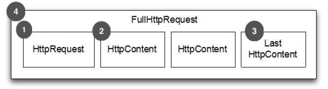
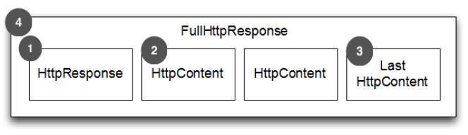
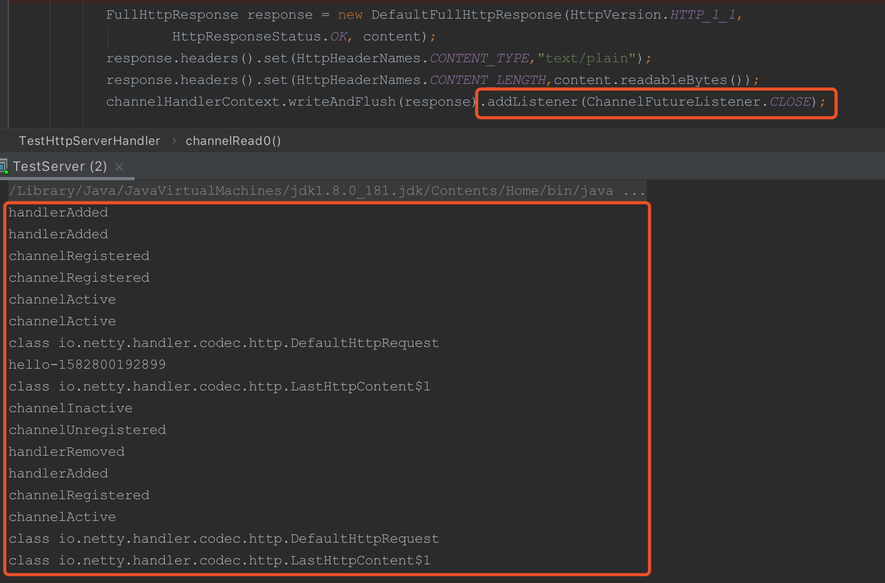

# Netty4入门基础(二)之Http请求分析

在前一篇文章里，我们实现了简单的http请求，并对/favicon.ico请求进行了过滤，这篇文章我们来分析请求的过程中发生了什么。

在TestServerHandle中的if判断之前，打印类名称

```
System.out.println(httpObject.getClass());
```

并重写ChannelHandlerAdapter的其他方法，打印出对应的名称

```
public class TestHttpServerHandler extends SimpleChannelInboundHandler<HttpObject> {
    /**
     * 读取客户端请求，返回响应
     * @param channelHandlerContext
     * @param httpObject
     * @throws Exception
     */
    @Override
    protected void channelRead0(ChannelHandlerContext channelHandlerContext, HttpObject httpObject) throws Exception {

        System.out.println(httpObject.getClass());

        if (httpObject instanceof HttpRequest){
           if (((HttpRequest) httpObject).uri().equals("/favicon.ico")){
               return;
           }
           ByteBuf content = Unpooled.copiedBuffer("hello", CharsetUtil.UTF_8);
           System.out.println(String.format("hello-%s",System.currentTimeMillis()));
           FullHttpResponse response = new DefaultFullHttpResponse(HttpVersion.HTTP_1_1,
                   HttpResponseStatus.OK, content);
           response.headers().set(HttpHeaderNames.CONTENT_TYPE,"text/plain");
           response.headers().set(HttpHeaderNames.CONTENT_LENGTH,content.readableBytes());
           channelHandlerContext.writeAndFlush(response);

       }
    }

    @Override
    public void handlerAdded(ChannelHandlerContext ctx) throws Exception {
        System.out.println("handlerAdded");
        super.handlerAdded(ctx);
    }

    @Override
    public void channelActive(ChannelHandlerContext ctx) throws Exception {
        System.out.println("channelActive");
        super.channelActive(ctx);
    }

    @Override
    public void channelRegistered(ChannelHandlerContext ctx) throws Exception {
        System.out.println("channelRegistered");
        super.channelRegistered(ctx);
    }

    @Override
    public void channelInactive(ChannelHandlerContext ctx) throws Exception {
        System.out.println("channelInactive");
        super.channelInactive(ctx);
    }

    @Override
    public void channelUnregistered(ChannelHandlerContext ctx) throws Exception {
        System.out.println("channelUnregistered");
        super.channelUnregistered(ctx);
    }

    @Override
    public void handlerRemoved(ChannelHandlerContext ctx) throws Exception {
        System.out.println("handlerRemoved");
        super.handlerRemoved(ctx);
    }
}
```

运行程序并用浏览器访问。会打印出以下结果，我们可以看到一个完整的过程，

1. 从添加-注册-活跃
2. 直到打印出类名称
3. 然后进入if判断，打印出hello
4. 这时出现了LastHttpContent$1
5. 之后又是DefaultHttpRequest类名称，是因为favicon.ico请求进来了
6. 但是它没有进入if，打印了LastHttpContent$1就结束了

这时就产生了两个疑问，

1. 为什么没有结束请求，因为我们还重写了channelUnregistered，handlerRemoved方法

2. 为什么每次请求后面都跟着LastHttpContent$1的类名称

```
handlerAdded
handlerAdded
channelRegistered
channelRegistered
channelActive
channelActive
class io.netty.handler.codec.http.DefaultHttpRequest
hello-1582798093588
class io.netty.handler.codec.http.LastHttpContent$1
class io.netty.handler.codec.http.DefaultHttpRequest
class io.netty.handler.codec.http.LastHttpContent$1
```

先解释第一个疑问，浏览器在访问时并不会主动断开，我在程序运行了一段时间后，捕捉到断开的输出，图片中的内容紧接着上面的打印内容。


在一串杂乱的输出后，我们可以截图里的红框看到，后续几组输出变得有规律，从添加，注册，活跃，不活跃，取消注册，移除。这很明显是浏览器在维持与程序之间的联系，不断得发起请求。但如果是用命令行的方式去访问则不会出现这样的情况，如curl命令等。

这时我们再看第二个问题，为什么会出现LastHttpContent$1

图片来源博客：[https://hhbbz.coding.me/blog/2018/07/25/Netty](https://hhbbz.coding.me/blog/2018/07/25/Netty入门浅析(2)/)

# 认识Http请求

在动手写Netty框架之前，我们先要了解http请求的组成，如下图：



1. HTTP Request 第一部分是包含的头信息
2. HttpContent 里面包含的是数据，可以后续有多个 HttpContent 部分
3. LastHttpContent 标记是 HTTP request 的结束，同时可能包含头的尾部信息
4. 完整的 HTTP request，由1，2，3组成



1. HTTP response 第一部分是包含的头信息
2. HttpContent 里面包含的是数据，可以后续有多个 HttpContent 部分
3. LastHttpContent 标记是 HTTP response 的结束，同时可能包含头的尾部信息
4. 完整的 HTTP response，由1，2，3组成

从图里便可以看出，LastHttpContent$1作为结束标志。

那应该如何解决浏览器和程序直接不断连接的问题呢，我们需要加入对channelHandlerContext的关闭，在最后一行中，关闭监听。

再看下面的输出，就是很完整的一组了。

