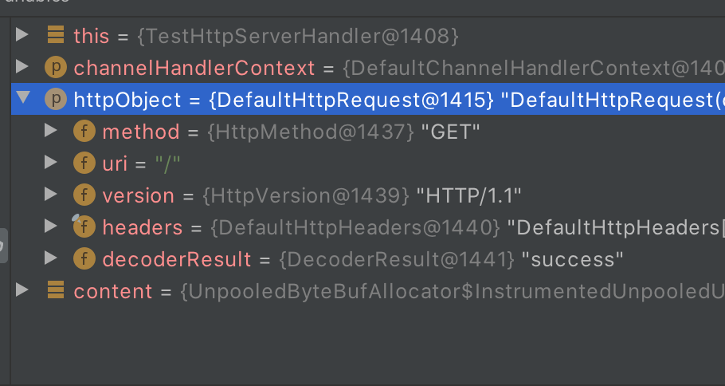
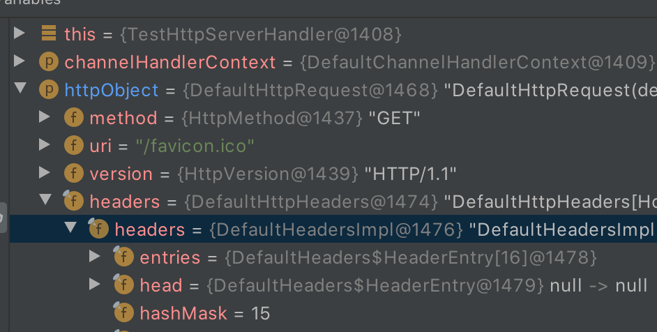

# Netty4入门基础之Http请求的编写和实现

### 借用知乎上一段话

> 作为一个学Java的，如果没有研究过Netty，那么你对Java语言的使用和理解仅仅停留在表面水平，会点SSH，写几个MVC，访问数据库和缓存，这些只是初等Java程序员干的事。如果你要进阶，想了解Java服务器的深层高阶知识，Netty绝对是一个必须要过的门槛。
>
> 有了Netty，你可以实现自己的HTTP服务器，FTP服务器，UDP服务器，RPC服务器，WebSocket服务器，Redis的Proxy服务器，MySQL的Proxy服务器等等。如果你想知道Nginx是怎么写出来的，如果你想知道Tomcat和Jetty是如何实现的，如果你也想实现一个简单的Redis服务器，那都应该好好理解一下Netty，它们高性能的原理都是类似的。

#### 作为一名初入职场不久的新人，CRUD是每天必干的事情，虽然知乎上的话有些激进，普通的业务逻辑其实也不是那么好搞，但确实还是有点道理的，我也开始系统的学习一遍netty，并希望能折腾出些成果，根据自己学习过程中遇到的坑和问题，不断整理更新这套教程。

本文尽量做到精简，通过一篇文章即可运行一个小实例。至于netty的概念和用途网上有很多写的非常棒的文章，这里就不赘述（复制）了，直接贴全套过程代码。

### 1.新建Maven项目，导入netty依赖

```
 <dependencies>
        <dependency>
            <groupId>io.netty</groupId>
            <artifactId>netty-all</artifactId>
            <version>4.1.42.Final</version>
        </dependency>
    </dependencies>
```

### 2.建立TestServer类，负责服务的启动

bossGroup和workerGroup其实是两个一样的EventLoopGroup，bossGroup负责接收请求，然后交给workerGroup去处理。

而childHandler则是加载我们写好的处理类。

future绑定服务端口便于访问，调用它的同步阻塞方法sync等待绑定操作完成。

使用f.channel().closeFuture().sync()方法进行阻塞,等待服务端链路关闭之后main函数才退出。

finally中负责优雅的关闭。

```
import io.netty.bootstrap.ServerBootstrap;
import io.netty.channel.ChannelFuture;
import io.netty.channel.EventLoopGroup;
import io.netty.channel.nio.NioEventLoopGroup;
import io.netty.channel.socket.nio.NioServerSocketChannel;
public class TestServer {
    public static void main(String[] args) throws InterruptedException {
        EventLoopGroup bossGroup = new NioEventLoopGroup();
        EventLoopGroup workerGroup = new NioEventLoopGroup();
        try {
            ServerBootstrap serverBootstrap = new ServerBootstrap();
            serverBootstrap.group(bossGroup,workerGroup).channel(NioServerSocketChannel.class)
                    .childHandler(new TestServerInitializer());

            ChannelFuture future = serverBootstrap.bind(8899).sync();
            future.channel().closeFuture().sync();
        }finally {
            bossGroup.shutdownGracefully();
            workerGroup.shutdownGracefully();
        }
    }
}
```

### 3.建立TestServerInitializer类

```
import io.netty.channel.ChannelInitializer;
import io.netty.channel.ChannelPipeline;
import io.netty.channel.socket.SocketChannel;
import io.netty.handler.codec.http.HttpServerCodec;
public class TestServerInitializer extends ChannelInitializer<SocketChannel> {

    @Override
    protected void initChannel(SocketChannel socketChannel) throws Exception {
        ChannelPipeline channelPipeline = socketChannel.pipeline();
        channelPipeline.addLast("httpServerCodec",new HttpServerCodec());
        channelPipeline.addLast("testHttpServerHandler",new TestHttpServerHandler());
    }
}
```

### 4.建立TestHttpServerHandler

这里就是我们具体接收http请求，并返回响应的地方，HttpHeaderNames.CONTENT_TYPE可以设置响应类型，这里使用plain，也可以换成"text/html; charset=UTF-8"，就可以按照html格式解析字符串。

```
import io.netty.buffer.ByteBuf;
import io.netty.buffer.Unpooled;
import io.netty.channel.ChannelHandlerContext;
import io.netty.channel.SimpleChannelInboundHandler;
import io.netty.handler.codec.http.*;
import io.netty.util.CharsetUtil;

public class TestHttpServerHandler extends SimpleChannelInboundHandler<HttpObject> {
    /**
     * 读取客户端请求，返回响应
     * @param channelHandlerContext
     * @param httpObject
     * @throws Exception
     */
    @Override
    protected void channelRead0(ChannelHandlerContext channelHandlerContext, HttpObject httpObject) throws Exception {
       if (httpObject instanceof HttpRequest){
           ByteBuf content = Unpooled.copiedBuffer("hello", CharsetUtil.UTF_8);
           System.out.println(String.format("hello-%s",System.currentTimeMillis()));
           FullHttpResponse response = new DefaultFullHttpResponse(HttpVersion.HTTP_1_1,
                   HttpResponseStatus.OK, content);
           response.headers().set(HttpHeaderNames.CONTENT_TYPE,"text/plain");
           response.headers().set(HttpHeaderNames.CONTENT_LENGTH,content.readableBytes());
           channelHandlerContext.writeAndFlush(response);
       }
    }
}
```

### 5.启动TestServer，在浏览器中访问http://localhost:8899

可以看到打印出hello，再去控制台看一下，会发现打印出两行

```
hello-1582684202033
hello-1582684204754
```

我们可以打断点看一下，发现第二次是有/favicon.ico请求进来了，这个是加载网页图标的。






### 6.过滤指定请求

我们可以在TestServerHandle中加入过滤操作，这样再访问就没有多余的显示了。

```
@Override
    protected void channelRead0(ChannelHandlerContext channelHandlerContext, HttpObject httpObject) throws Exception {
       if (httpObject instanceof HttpRequest){
           if (((HttpRequest) httpObject).uri().equals("/favicon.ico")){
               return;
           }
           ByteBuf content = Unpooled.copiedBuffer("hello", CharsetUtil.UTF_8);
           System.out.println(String.format("hello-%s",System.currentTimeMillis()));
           FullHttpResponse response = new DefaultFullHttpResponse(HttpVersion.HTTP_1_1,
                   HttpResponseStatus.OK, content);
           response.headers().set(HttpHeaderNames.CONTENT_TYPE,"text/plain");
           response.headers().set(HttpHeaderNames.CONTENT_LENGTH,content.readableBytes());
           channelHandlerContext.writeAndFlush(response);
       }
    }
```

