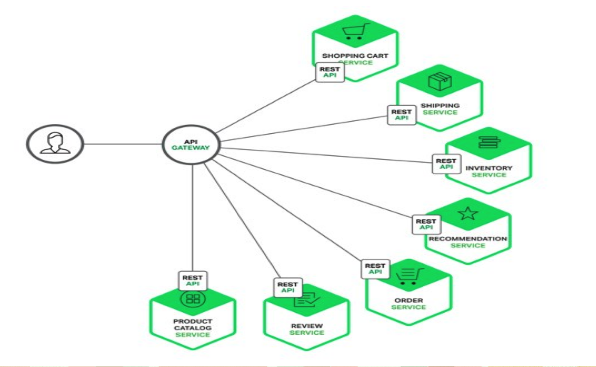
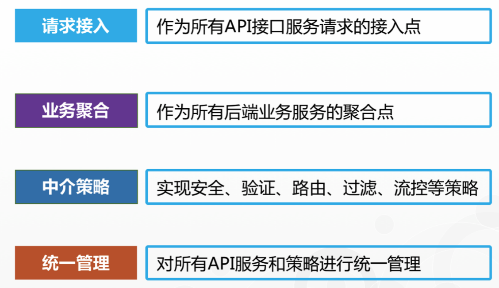
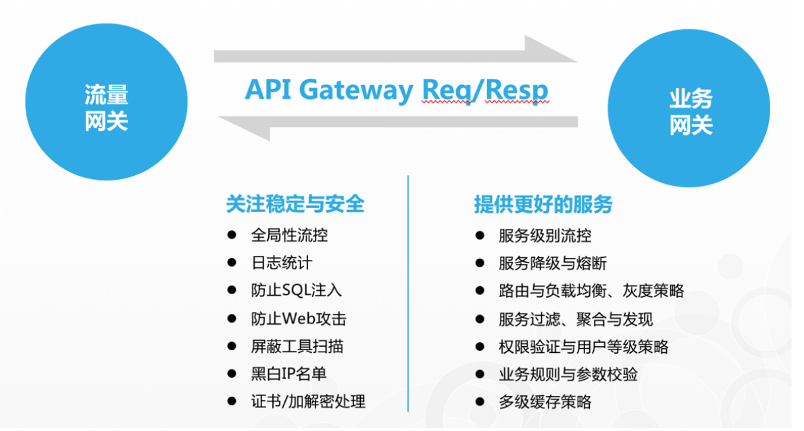
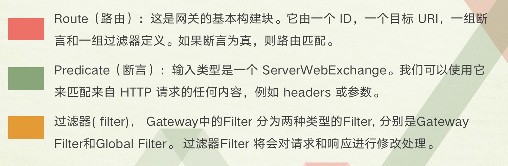
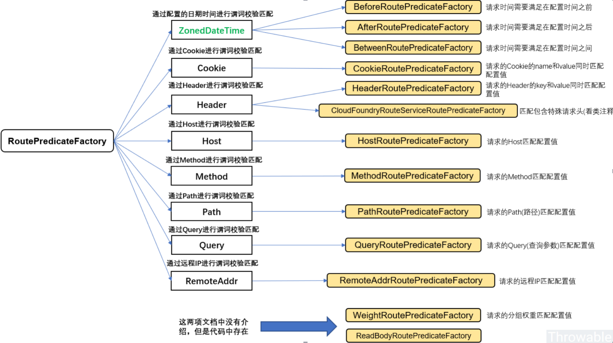
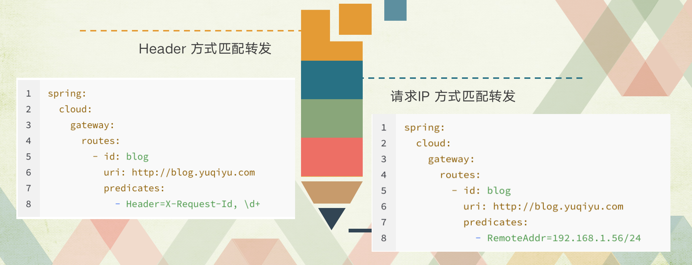

# Gateway网关简介及使用

##  1. 什么是 API 网关（API Gateway）
### 分布式服务架构、微服务架构与 API 网关

> 在微服务架构里，服务的粒度被进一步细分，各个业务服务可以被独立的设计、开发、测试、部署和管理。这时，各个独立部署单元可以用不同的开发测试团队维护，可以使用不同的编程语言和技术平台进行设计，这就要求必须使用一种语言和平 台无关的服务协议作为各个单元间的通讯方式。



### API 网关的定义

>  网关的角色是作为一个 API 架构，用来保护、增强和控制对于 API 服务的访问。
>
> API 网关是一个处于应用程序或服务（提供 REST API 接口服务）之前的系统，用来管理授权、访问控制和流量限制等，这样 REST API 接口服务就被 API 网关保护起来，对所有的调用者透明。因此，隐藏在 API 网关后面的业务系统就可以专注于创建和管理服务，而不用去处理这些策略性的基础设施。

### API 网关的职能



### API 网关的分类与功能



## 2. Gateway是什么

> Spring Cloud Gateway是Spring官方基于Spring 5.0，Spring Boot 2.0和Project Reactor等技术开发的网关，Spring Cloud Gateway旨在为微服务架构提供一种简单而有效的统一的API路由管理方式。Spring Cloud Gateway作为Spring Cloud生态系中的网关，目标是替代ZUUL，其不仅提供统一的路由方式，并且基于Filter链的方式提供了网关基本的功能，例如：安全，监控/埋点，和限流等。

## 3. 为什么用Gateway

Spring Cloud Gateway 可以看做是一个 Zuul 1.x 的升级版和代替品，比 Zuul 2 更早的使用 Netty 实现异步 IO，从而实现了一个简单、比 Zuul 1.x 更高效的、与 Spring Cloud 紧密配合的 API 网关。
Spring Cloud Gateway 里明确的区分了 Router 和 Filter，并且一个很大的特点是内置了非常多的开箱即用功能，并且都可以通过 SpringBoot 配置或者手工编码链式调用来使用。
比如内置了 10 种 Router，使得我们可以直接配置一下就可以随心所欲的根据 Header、或者 Path、或者 Host、或者 Query 来做路由。
比如区分了一般的 Filter 和全局 Filter，内置了 20 种 Filter 和 9 种全局 Filter，也都可以直接用。当然自定义 Filter 也非常方便。

### 最重要的几个概念









## 4. Gateway怎么用

说白了 Predicate 就是为了实现一组匹配规则，方便让请求过来找到对应的 Route 进行处理，接下来我们接下 Spring Cloud GateWay 内置几种 Predicate 的使用。

### 通过时间匹配

Predicate 支持设置一个时间，在请求进行转发的时候，可以通过判断在这个时间之前或者之后进行转发。比如我们现在设置只有在 2019 年 1 月 1 日才会转发到我的网站，在这之前不进行转发，我就可以这样配置：

```
spring:
  cloud:
    gateway:
      routes:
       - id: time_route
        uri: http://ityouknow.com
        predicates:
         - After=2018-01-20T06:06:06+08:00[Asia/Shanghai]


```

Spring 是通过 ZonedDateTime 来对时间进行的对比，ZonedDateTime 是 Java 8 中日期时间功能里，用于表示带时区的日期与时间信息的类，ZonedDateTime 支持通过时区来设置时间，中国的时区是：`Asia/Shanghai`。

After Route Predicate 是指在这个时间之后的请求都转发到目标地址。上面的示例是指，请求时间在 2018 年 1 月 20 日 6 点 6 分 6 秒之后的所有请求都转发到地址`http://ityouknow.com`。`+08:00`是指时间和 UTC 时间相差八个小时，时间地区为`Asia/Shanghai`。

添加完路由规则之后，访问地址`http://localhost:8080`会自动转发到`http://ityouknow.com`。

Before Route Predicate 刚好相反，在某个时间之前的请求的请求都进行转发。我们把上面路由规则中的 After 改为 Before，如下：

```
spring:
  cloud:
    gateway:
      routes:
       - id: after_route
        uri: http://ityouknow.com
        predicates:
         - Before=2018-01-20T06:06:06+08:00[Asia/Shanghai]


```

就表示在这个时间之前可以进行路由，在这时间之后停止路由，修改完之后重启项目再次访问地址`http://localhost:8080`，页面会报 404 没有找到地址。

除过在时间之前或者之后外，Gateway 还支持限制路由请求在某一个时间段范围内，可以使用 Between Route Predicate 来实现。

```
spring:
  cloud:
    gateway:
      routes:
       - id: after_route
        uri: http://ityouknow.com
        predicates:
         - Between=2018-01-20T06:06:06+08:00[Asia/Shanghai], 2019-01-20T06:06:06+08:00[Asia/Shanghai]


```

这样设置就意味着在这个时间段内可以匹配到此路由，超过这个时间段范围则不会进行匹配。通过时间匹配路由的功能很酷，可以用在限时抢购的一些场景中。

### 通过 Cookie 匹配

Cookie Route Predicate 可以接收两个参数，一个是 Cookie name , 一个是正则表达式，路由规则会通过获取对应的 Cookie name 值和正则表达式去匹配，如果匹配上就会执行路由，如果没有匹配上则不执行。

```
spring:
  cloud:
    gateway:
      routes:
       - id: cookie_route
         uri: http://ityouknow.com
         predicates:
         - Cookie=ityouknow, kee.e


```

使用 curl 测试，命令行输入:

```
curl http://localhost:8080 --cookie "ityouknow=kee.e"


```

则会返回页面代码，如果去掉`--cookie "ityouknow=kee.e"`，后台汇报 404 错误。

Header Route Predicate 和 Cookie Route Predicate 一样，也是接收 2 个参数，一个 header 中属性名称和一个正则表达式，这个属性值和正则表达式匹配则执行。

```
spring:
  cloud:
    gateway:
      routes:
      - id: header_route
        uri: http://ityouknow.com
        predicates:
        - Header=X-Request-Id, \d+


```

使用 curl 测试，命令行输入:

```
curl http://localhost:8080  -H "X-Request-Id:666666" 


```

则返回页面代码证明匹配成功。将参数`-H "X-Request-Id:666666"`改为`-H "X-Request-Id:neo"`再次执行时返回 404 证明没有匹配。

### 通过 Host 匹配

Host Route Predicate 接收一组参数，一组匹配的域名列表，这个模板是一个 ant 分隔的模板，用`.`号作为分隔符。它通过参数中的主机地址作为匹配规则。

```
spring:
  cloud:
    gateway:
      routes:
      - id: host_route
        uri: http://ityouknow.com
        predicates:
        - Host=**.ityouknow.com


```

使用 curl 测试，命令行输入:

```
curl http://localhost:8080  -H "Host: www.ityouknow.com" 
curl http://localhost:8080  -H "Host: md.ityouknow.com" 


```

经测试以上两种 host 均可匹配到 host_route 路由，去掉 host 参数则会报 404 错误。

### 通过请求方式匹配

可以通过是 POST、GET、PUT、DELETE 等不同的请求方式来进行路由。

```
spring:
  cloud:
    gateway:
      routes:
      - id: method_route
        uri: http://ityouknow.com
        predicates:
        - Method=GET


```

使用 curl 测试，命令行输入:

```
# curl 默认是以 GET 的方式去请求
curl http://localhost:8080


```

测试返回页面代码，证明匹配到路由，我们再以 POST 的方式请求测试。

```
# curl 默认是以 GET 的方式去请求
curl -X POST http://localhost:8080


```

返回 404 没有找到，证明没有匹配上路由

### 通过请求路径匹配

Path Route Predicate 接收一个匹配路径的参数来判断是否走路由。

```
spring:
  cloud:
    gateway:
      routes:
      - id: host_route
        uri: http://ityouknow.com
        predicates:
        - Path=/foo/{segment}


```

如果请求路径符合要求，则此路由将匹配，例如：/foo/1 或者 /foo/bar。

使用 curl 测试，命令行输入:

```
curl http://localhost:8080/foo/1
curl http://localhost:8080/foo/xx
curl http://localhost:8080/boo/xx


```

经过测试第一和第二条命令可以正常获取到页面返回值，最后一个命令报 404，证明路由是通过指定路由来匹配。

### 通过请求参数匹配

Query Route Predicate 支持传入两个参数，一个是属性名一个为属性值，属性值可以是正则表达式。

```
spring:
  cloud:
    gateway:
      routes:
      - id: query_route
        uri: http://ityouknow.com
        predicates:
        - Query=smile


```

这样配置，只要请求中包含 smile 属性的参数即可匹配路由。

使用 curl 测试，命令行输入:

```
curl localhost:8080?smile=x&id=2


```

经过测试发现只要请求汇总带有 smile 参数即会匹配路由，不带 smile 参数则不会匹配。

还可以将 Query 的值以键值对的方式进行配置，这样在请求过来时会对属性值和正则进行匹配，匹配上才会走路由。

```
spring:
  cloud:
    gateway:
      routes:
      - id: query_route
        uri: http://ityouknow.com
        predicates:
        - Query=keep, pu.


```

这样只要当请求中包含 keep 属性并且参数值是以 pu 开头的长度为三位的字符串才会进行匹配和路由。

使用 curl 测试，命令行输入:

```
curl localhost:8080?keep=pub


```

测试可以返回页面代码，将 keep 的属性值改为 pubx 再次访问就会报 404, 证明路由需要匹配正则表达式才会进行路由。

### 通过请求 ip 地址进行匹配

Predicate 也支持通过设置某个 ip 区间号段的请求才会路由，RemoteAddr Route Predicate 接受 cidr 符号 (IPv4 或 IPv6) 字符串的列表(最小大小为 1)，例如 192.168.0.1/16 (其中 192.168.0.1 是 IP 地址，16 是子网掩码)。

```
spring:
  cloud:
    gateway:
      routes:
      - id: remoteaddr_route
        uri: http://ityouknow.com
        predicates:
        - RemoteAddr=192.168.1.1/24


```

可以将此地址设置为本机的 ip 地址进行测试。

果请求的远程地址是 192.168.1.10，则此路由将匹配。

### 组合使用

上面为了演示各个 Predicate 的使用，我们是单个单个进行配置测试，其实可以将各种 Predicate 组合起来一起使用。

例如：

```
spring:
  cloud:
    gateway:
      routes:
       - id: host_foo_path_headers_to_httpbin
        uri: http://ityouknow.com
        predicates:
        - Host=**.foo.org
        - Path=/headers
        - Method=GET
        - Header=X-Request-Id, \d+
        - Query=foo, ba.
        - Query=baz
        - Cookie=chocolate, ch.p
        - After=2018-01-20T06:06:06+08:00[Asia/Shanghai]


```

各种 Predicates 同时存在于同一个路由时，请求必须同时满足所有的条件才被这个路由匹配。

> 一个请求满足多个路由的谓词条件时，请求只会被首个成功匹配的路由转发

## 